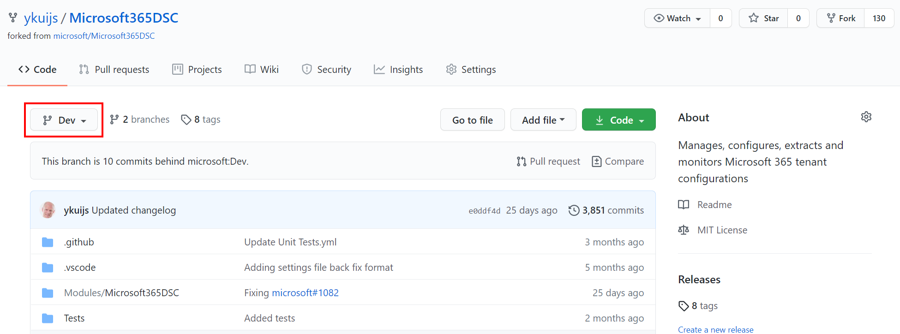
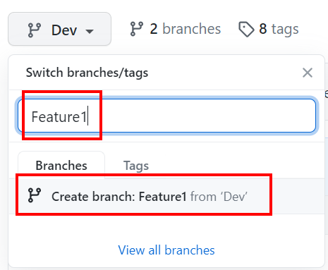
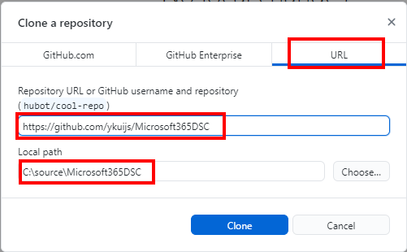
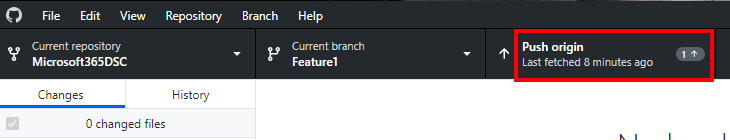
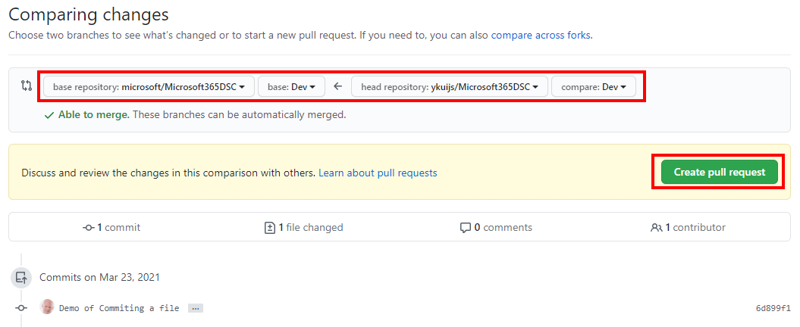

# Setting up your Environment to Contribute to the Project

The Microsoft365DSC project is open to contribution from the community. In order to contribute to it, you are expected to have some basic level of knowledge of how GitHub works. This wiki page tries to simplify the process of contributing back to the project by providing you with a step-by-step process.

1. **Fork the base repository**

- Navigate to the main repository page of the Microsoft365DSC project (e.g. https://GitHub.com/Microsoft/Microsoft365DSC);

- In the top right corner of the page, click on the **Fork** button;

{ align=center width=500 }

- A dialog box asking you to select the account to fork the repository will appear. Select your account from the list.

{ width=500 }

- The forking process should only take a few seconds. While the forking is in progress you will see the following screen.

{ align=center width=500 }

- Once completed, you have now a completely forked repository, meaning you have an exact replica of the main repository, under you own GitHub account. The changes you will be working on, will be done in this new forked repository. Once you are satisfied with your changes, they can be submitted back to the owners of the main Module repository via what we call a **Pull Request** (covered later in this post).

2. **Create a Feature Branch**

- Creating a Fork is the equivalent of creating a separate workspace for you to start working on your changes. What we need to do now, is create a new Branch inside that Fork. Think of a branch as being a project within your workspace. Every feature or issue you work on should be in its own branch. By default, when you forked the main repository, you created a copy of the **Dev** repository from the main repository, inside your fork. Every branch you create in your fork, will essentially be a copy of that Forked Dev branch. Let's put all this in context:

          **Main Repository**                             **Forked Repository**
                 Branches:                                      Branches:
                     - Dev                                            - Dev
                                                                           --> Feature 1
                                                                           --> Feature 2
                                                                           --> ...

In the example above, Feature 1 and Feature 2 are both branches that were created from the Dev branch of the Forked Repository. In order to submit the changes in Feature 1 back into the Main Repository, you will need to first create a Pull Request to have Feature 1 merged back into the Dev branch of your Forked Repository, and then once done, create yet another Pull Request to merge the Forked Repository's Dev branch (which now includes the changes for Feature 1) back in the Main Repository's Dev branch.

- To create a branch, navigate to the main page of your Forked Repository, and click on the **Branch** button.

{ align=center width=500 }

- The next step is not intuitive, but to create a new branch, simply start typing the name of the new branch you wish to create and press enter.

{ align=center width=500 }

- This will automatically create the branch inside your Forked Repository. In order to validate that you are currently viewing file from the branch you just created, you should now see the Branch button listing the newly created branch on the Forked Repository's home page.

{ align=center width=500 }

3. **Cloning the Forked Repository**

- In GitHub, cloning is the process of "downloading" the content of a branch onto your local machine for editing. My recommendation here will be to download and install the GitHub client for Windows https://desktop.github.com/. It just makes things a lot easier than having to deal with the console Git client (or even the VSCode built-in tools for that matter).

- Open GitHub for Windows, and select **File > Clone Repository...**.

{ align=center width=500 }

- In the Clone a Repository dialogue, select the **URL** tab and provide the URL to your Forked Repository, as well as a local path where the content of the repository is going to be downloaded locally. Click on the **Clone** button.

{ align=center width=500 }

- Wait for the cloning to finish.

- You now have a local copy of the repository on your local machine.

4. **Changing Branches**

- Once you have cloned the Forked Repository onto your local machine, you can easily go and change Branch by simply clicking on the **Current Branch** at the top of the GitHub client for Windows and by selecting the branch you wish to work on.

{ align=center width=500 }

- The moment you change branch from the GitHub client, the file that are located in the directory where you cloned the Forked Repository's content will get updated with the content for that branch. When dealing with Git, you always work in the same clone repository. The fact that you have multiple branches existing in a clone repository doesn't mean that you will have multiple copies of the files on the machine. You control what version of the files will be in that local repository by changing the current Branch in the GitHub client for Windows.

5. **Making Changes**

- Once you made sure the branch representing the feature or the issue you are about to work on is selected in the Current Branch of the GitHub client for Windows, you can go ahead and start making changes to the local files. I personally recommend editing the files in Visual Studio Code (https://code.visualstudio.com/), but using other tools such as the PowerShell Integrated Script Editor (ISE) or even other Scripting Editor tool will work just as good.

6. **Committing Changes**

- Committing changes in the context of Git means saving the changes in the currently selected branch, but **locally**. Git keeps some sort of a local database when a repository is cloned, and upon committing changes, these are saved back to the local database. So for example, if you are working on multiple changes in various branches at the same time, you want to make sure you commit your changes to the current branch before using the GitHub client for Windows to change branch. Otherwise your changes will get overwritten by the changes in the newly selected branch (remember that changing a branch updates the local files).

- To commit a change, once the changes are made to the files, open the GitHub Client for Windows. the client should be smart enough to automatically detect that changes have been made.

{ align=center width=500 }

- Once changes are detected in the GitHub client for Windows, you will be allowed to give a Summary and a Description for the changes you are about to commit, and to commit them back to the local database by clicking on the **Commit To** button.

{ align=center width=500 }

7. **Push Committed Changes Back to GitHub**

- Now the changes have been committed back to the local database, we need to Push them up back into GitHub. To do so, we need to click on the **Push Origin** button at the top of the GitHub client for Windows.

{ align=center width=500 }

- To validate that your recent changes have been successfully uploaded back into GitHub, navigate to the main page of your Forked Repository, and make sure you select the branch in which you just uploaded (PUSHED) you changes back into. You should see a mention at the top, in the history section, that lists your latest changes that have been successfully uploaded back into GitHub.

{ align=center width=500 }

8. **Merging the Changes back into Your Dev Branch**

- As explained in step 2 above, the operation of merging two branches together in Git is called a Pull Request. In our case we discussed that once you are done making changes in your branch, inside your Forked Repository, that 2 Pull Requests have to happen before your changes make it back into the Main Repository.

- The first Pull Request will merge the changes in your Feature/Issue specific branch, back into your Forked Repository's Dev branch. To initiate a Pull Request, click on the **Branch** menu inside the GitHub client for Windows, and select the **Create pull request** option.

{ align=center width=500 }

- This will launch the GitHub Pull request form in the browser. Make sure you update the left drop down menu (base:) to point to your Forked Repository's Dev Branch.

{ align=center width=500 }

- Make sure that the right hand drop down menu (compare:) has your feature/issue specific branch selected.

{ align=center width=500 }

- Now that both the base and compare branches have been properly selected, you can initiate the Pull Request by clicking on the **Create pull request** button.

{ align=center width=500 }

- If all goes well and no conflicts were detected, GitHub will offer you the option to **Merge pull request**. Click on that green button to initiate the merge operation.

{ align=center width=500 }

- This will prompt you to confirm your intentions. Click on the **Confirm merge** green button.

{ align=center width=500 }

- At this point, your changes have been successfully merged back into the Dev branch of your Forked Repository, and chances are you no longer need that Feature/Issue specific branch. You can simply delete it by clicking the purple **Delete branch** button that GitHub presents to you.

{ align=center width=500 }

- We are almost there, we now need to create yet another Pull Request, this time to merge the changes we just merged into our Forked Repository's Dev branch back into the Main Repository's Dev branch. From the GitHub client, select once again the **Branch > Create pull request** option.

{ align=center width=500 }

- This time around, in the Pull Request online form, make sure the left branch (base fork:) is pointing to the Main Repository's Dev branch, and that the right one (head fork:) is set to your Forked Repository's Dev branch.

{ align=center width=500 }

- Click on the green **Create pull request** button.

- Provide a Summary and a Description for your Pull Request, and click on the green **Create pull request** button yet again.

{ align=center width=500 }

- At that point, you are done! The Core team will review your changes, provide feedback if required, and will merge the changes back into the official Main Repository.

Thanks for contributing to Microsoft365Dsc!
