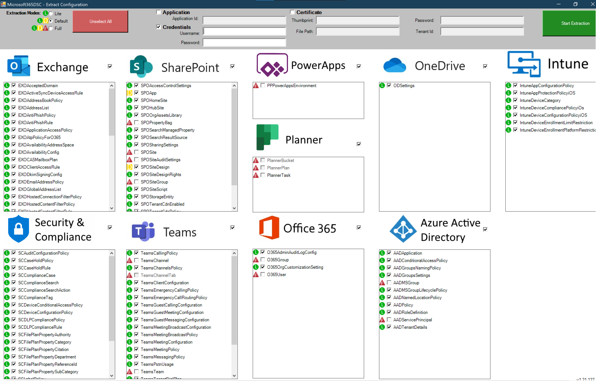
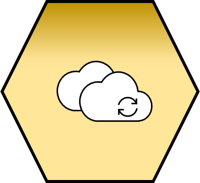
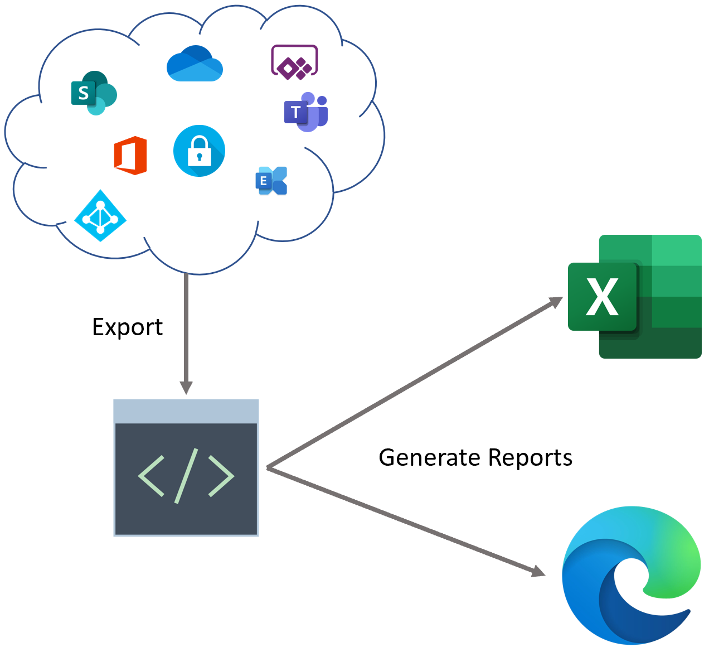

# What is Microsoft365DSC?

Microsoft365DSC is an Open-Source initiative lead by Microsoft engineers and maintained by the community. It allows you to write a definition for how your Microsoft 365 tenant should be configured, automate the deployment of that configuration and ensures the monitoring of the defined configuration, notifying and acting on detected configuration drifts. It also allows you to extract a full-fidelity configuration out of any existing Microsoft 365 tenant. The tool covers all major Microsoft 365 workloads such as Exchange Online, Teams, SharePoint, OneDrive, Security and Compliance, Power Platforms, Intune and Planner.

Microsoft365DSC is built as a module for the [PowerShell Desired State Configuration](https://docs.microsoft.com/en-us/powershell/scripting/dsc/overview) framework and is made available via the [PowerShell Gallery](https://www.powershellgallery.com/packages/Microsoft365DSC/).

{ align=center width=500 }

## Automate { align=left width=100 }

Using PowerShell Desired State Configuration (DSC) syntax, write a complete definition of how you want your Microsoft 365 tenant to be configured. The Microsoft365DSC module allows Microsoft 365 administrators to define the configuration(s) of the various workloads (SharePoint, Exchange, Security & Compliance, Teams, etc.), and apply the configuration in an automated way. For example, administrators that wish to deploy a new Search Managed Property to their SharePoint Online workload, can do so with similar lines of code (all code examples can be found on the [Resources List](../resources/overview/) page):

```PowerShell
SPOSearchManagedProperty SearchMP
{
    Searchable                  = $True
    FullTextIndex               = ""
    MappedCrawledProperties     = @()
    GlobalAdminAccount          = $Credscredential
    LanguageNeutralTokenization = $True
    CompanyNameExtraction       = $False
    AllowMultipleValues         = $True
    Aliases                     = $True
    Queryable                   = $True
    Name                        = "TestManagedProperty"
    Safe                        = $True
    Description                 = "Description of item"
    FinerQueryTokenization      = $True
    Retrievable                 = $True
    Type                        = "Text"
    CompleteMatching            = $True
    FullTextContext             = 4
    Sortable                    = "Yes"
    Refinable                   = "Yes"
    Ensure                      = "Present"
    TokenNormalization          = $True
}
```

Just like any other normal PowerShell DSC configuration, your Microsoft365DSC file will need to be compiled into a .MOF file for the Local Configuration Manager to be able to apply it. Once your configuration file has been compiled, you can execute the configuration process by calling into the **Start-DSCConfiguration** PowerShell cmdlet. All configuration resources defined by Microsoft365DSC will make remote calls back to the Microsoft 365 tenant using various underlying frameworks and components (Microsoft Teams PowerShell Module, SharePoint PnP, Azure Active Directory, etc.). It is therefore important that the machine that executes the configuration has internet connectivity back to the Microsoft 365 tenant you are trying to configure. For additional information on how to get started with PowerShell Desired State Configuration, you can refer to the [Introduction to PowerShell Desired State Configuration](https://channel9.msdn.com/Series/SharePoint-Automation-with-DSC/Video-Introduction-to-PowerShell-DSC) training video.

See the [Automating](../../user-guide/get-started/deploying-configurations/) page for more information about possible options.

## Export { align=left width=100 }

Microsoft365DSC is the very first PowerShell project that natively supports ReverseDSC. This means that by simply installing the module, you are able to leverage ReverseDSC to extract the entire configuration of any existing tenants. The module exposes a cmdlet called **Export-M365DSCConfiguration** which launches a Graphical User Interface (GUI) that allows you to pick and choose what configuration components you wish to extract in a granular fashion.

{ align=center width=500 }

Upon providing credentials with correct permissions, the tool will begin the extraction of the configuration. Once it completes the extraction, it will prompt you to specify a destination directory to store the extracted artifacts.

The tool will extract several artifacts, including all SharePoint Add-ins and Frameworks packages, the configuration itself, and a metadata file that contains all variables that are specific to your environment. That metadata file (.psd1) abstracts components of your configuration, such as the tenant name, in order to make it as easy as possible for you to replicate those configurations across tenants. As an example, you can extract the configuration from any given tenant using the ReverseDSC functionality, open the extracted .psd1 metadata file, change the tenant's name to a new destination, and apply that new configuration. This allows organizations to keep the configuration of multiple tenants in synchronization with one another.

See the [Exporting](../../user-guide/get-started/snapshot-of-existing-tenant/) page for more information about possible options.

## Synchronize { align=left width=100 }

Microsoft365DSC makes it very easy for users to keep multiple tenants' configuration synchronized. With the tool you can export the configuration from any existing tenant and re-apply it onto multiple other tenants, keeping their configuration synchronized.

{ align=center width=500 }

You can use this to grab the configuration of a production tenant and apply this configuration onto a test tenant, making sure you can troubleshoot issues with the exact production configuration.

## Assess { align=left width=100 }

Assess any Microsoft 365 tenant against a known good configuration and generate a discrepency report. Microsoft365DSC makes it feasible for organizations to validate the configuration of their existing Microsoft 365 tenant against industry's best practices with a single line command. You can assess any tenant against any baseline configuration that you and your team developed or use official Blueprints.

{ align=center width=500 }

Microsoft365DSC also allows you to compare two configuration files and obtain the delta between the two. Whether you wish to compare the configuration between 2 tenants or two point-in-time exports of the same tenant, we've got you covered!

{ align=center width=500 }

See the [Assessing](../../user-guide/advanced/create-blueprint/) page for more information about possible options.

## Monitor { align=left width=100 }

Automatic monitoring of configuration drifts in your tenant and notification about detected drifts with in-depth details for troubleshooting. Microsoft365DSC will perform regular checks to detect configuration drifts (every 15 minutes by default) and can take one of the following 3 actions when drifts are detected:

- Fix the drift automatically by re-applying the desired configuration;
- Log detailed information about the drifts detected in Event Viewer;
- Notify administrators via emails when drifts are detected, providing them with a detailed report as to what the drifts are (requires the use of Azure DevOPS pipelines);

{ align=center width=500 }

See the [Monitoring](../../user-guide/get-started/monitoring-drifts/) page for more information about possible options.

## Report { align=left width=100 }

Take any Microsoft365DSC configuration and generate a user friendly report from it in an Excel or HTML format. With a single command you can convert any Microsoft365DSC configuration

{ align=center width=500 }

See the [Reporting](../../user-guide/get-started/generating-reports/) page for more information about possible options.
