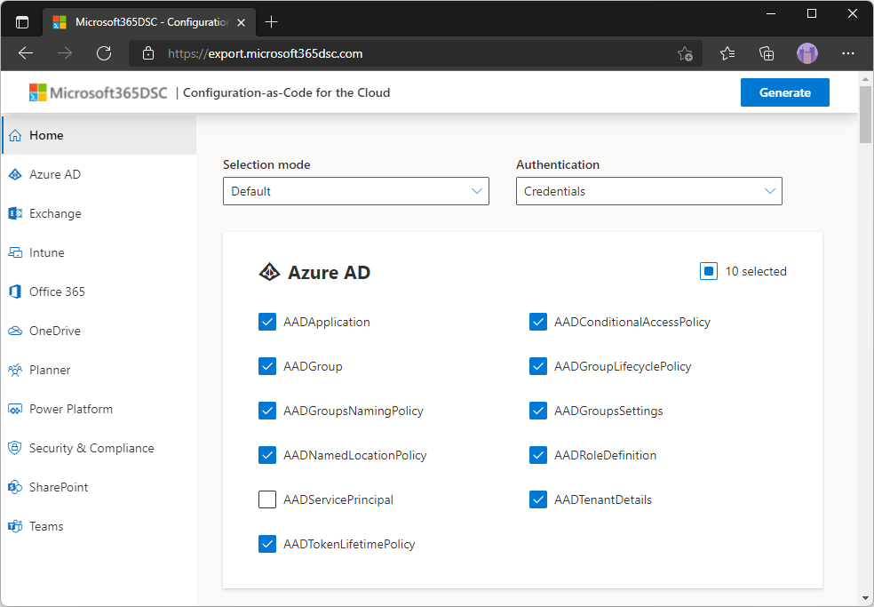
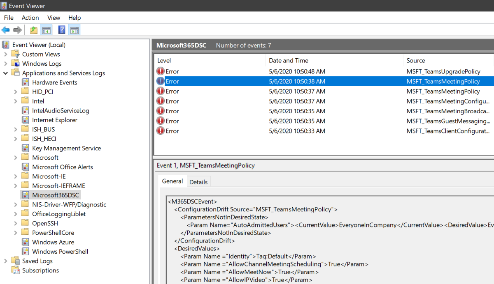

!!! cite "What is Microsoft365DSC?"

    Microsoft365DSC is a free open-source tool led by Microsoft engineers and maintained by the community.

# Export your configuration

Microsoft365DSC is the most comprehensive and complete solution to have your Microsoft 365 tenant configuration simple and stable. It's an Open-Source initiative hosted on [GitHub](https://github.com/Microsoft/Microsoft365DSC), lead by Microsoft engineers and maintained by the community.

# Monitor your configuration

If something changes in your tenant's configuration, the continous monitoring feature of Microsoft365DSC, will automatically detect a drift and can act upon it.

# Secure your configuration

Microsoft365DSC is the most comprehensive and complete solution to have your Microsoft 365 tenant configuration simple and stable. It's an Open-Source initiative hosted on [GitHub](https://github.com/Microsoft/Microsoft365DSC), lead by Microsoft engineers and maintained by the community.

# Test your configuration

Microsoft365DSC is the most comprehensive and complete solution to have your Microsoft 365 tenant configuration simple and stable. It's an Open-Source initiative hosted on [GitHub](https://github.com/Microsoft/Microsoft365DSC), lead by Microsoft engineers and maintained by the community.

## Why Microsoft365DSC?

Microsoft365DSC allows you to write your Cloud configuration as Code, automate the deployment of that configuration, and ensures the monitoring of that configuration, notifying and acting on detected drifts. It also allows you to extract a configuration out of any existing Microsoft 365 tenant and import into another. The tool covers all major Microsoft 365 workloads such as Exchange Online, Teams, Power Platform, SharePoint, Security and Compliance.

## Export your configuration

Microsoft365DSC allows you to replicate configurations over Microsoft 365 Tenants, or to keep multiple Tenants in sync configuration wise.

## Report on your configuration

Microsoft365DSC provides you with options to convert the extracted configurations into both an HTML report or an Excel report, making it easy for you to review your configuration.

## Analyse your configuration

Microsoft365DSC has a continious monitoring feature that will allow to automatically detect a drift and act on it if needed.

## Compare your configuration against Best Practices

Microsoft365DSC can compare the configuration of your current tenant against a set of best practices (called a Blueprint) that are recommended by Microsoft and the Community. It will recommend why you need to change a setting and how to configure them in a certain way.

