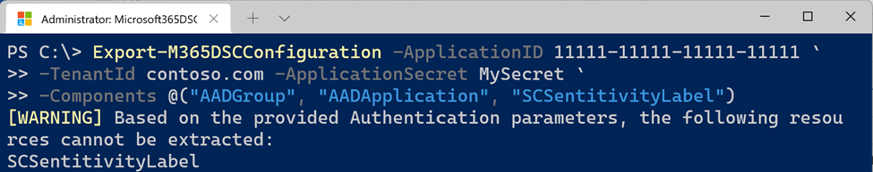
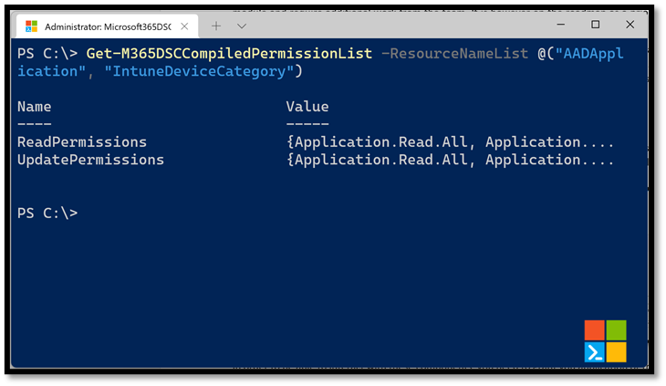
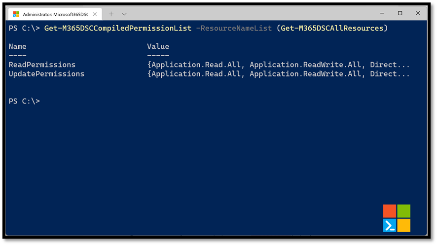
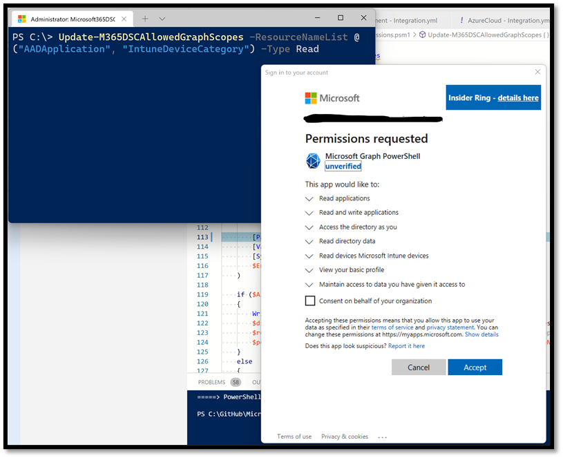
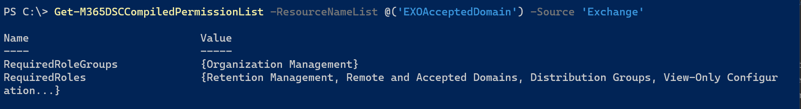

## Authentication Options

Each of the required modules used by Microsoft365DSC has its own authentication possibilities. So depending on the DSC resource you are using, there are several authentication options to choose from.

It is also very important to understand the authentication process of Microsoft365DSC. The solution supports connecting to the various workloads for either applying the configuration, monitoring it for configuration drifts or taking a snapshot of an existing configuration. There are two ways of authenticating to Microsoft 365:

1. A set of credentials for a user
2. A Service Principal by specifying parameters such as an Azure Active Directory (AD) Application ID, Tenant ID and a Secret or Certificate.

Currently, each Microsoft 365 workload can support a different combination of authentication methods because of the underlying modules only supporting those methods. The table in the next paragraph shows which workload uses which module and therefore supports which authentication method.

**Important**: The recommendation is to use Service Principal whenever possible because:

- Service principals offers the most granular levels of security and do not introduce the risk of having to send high privileged credentials across the wire to authenticate.
- Since Desired State Configuration is an unattended process, the use of Multi Factor Authentication for user credentials  is not supported by Microsoft365DSC.
  - ***Note:*** The only exception here is creating an Export of an existing tenant. Most often this is an interactive process where the ask for a second factor is possible.

## Authentication Methods

The following table provides an overview of what authentication methods are supported by which workload and what underlying module is being used to authenticate:

| Workload | PowerShell Module | Credential | Service Principal | | | Managed Identity |
| --       | --                | -- | -- | -- | -- | -- |
|          |                   |    | **Certificate Thumbprint** | **Certificate Path** | **Application Secret** |
| *AzureAD** | Microsoft.Graph.Authentication<br /> (Connect-MgGraph) |  |  |  |  |  |
| *Exchange Online* | ExchangeOnlineManagement<br /> (Connect-ExchangeOnline) |  |  |  |  |  |
| *Intune** | Microsoft.Graph.Authentication<br /> (Connect-MgGraph) |  |  |  |  |  |
| *Office 365** | Microsoft.Graph.Authentication<br /> (Connect-MgGraph) |  |  |  |  |  |
| *OneDrive* | PnP.PowerShell (Connect-PnPOnline) |  |  |  |  |  |
| *Power Apps* | Microsoft.PowerApps.<br />Administration.PowerShell |  |  |  |  |  |
| *Planner** | Microsoft.Graph.Authentication<br /> (Connect-MgGraph) |  |  |  |  |  |
| *Security & Compliance Center* | ExchangeOnlineManagement<br /> (Connect-IPPSSession) |  |  |  |  |  |
| *SharePoint Online* | PnP.PowerShell<br /> (Connect-PnPOnline) |  |  |  |  |  |
| *Teams* | MicrosoftTeams<br /> (Connect-MicrosoftTeams) |  |  |  |  |  |

>  = Supported /  = Not supported

We are having discussions with the various product groups that are responsible for these PowerShell modules inside of Microsoft, to have better consistency across all workloads on how to authenticate. Items in the table above marked with a asterisk (*), are workloads for which the <a href="https://github.com/microsoftgraph/msgraph-sdk-powershell" target="_blank">Microsoft Graph PowerShell SDK</a> is used to authenticate against. The plan is to update the underlying logic of every component inside of Microsoft365DSC to leverage that SDK as new APIs become available on Microsoft Graph.

It is possible for a configuration to use a mix of Credentials and Service Principals to authenticate against the various workloads. For example, if you decide to keep a master configuration for all the configuration of your tenant, you could have Azure AD components use the Service Principal of an app you have created to authenticate, and further down in the configuration have your Security and Compliance components use credentials. That approach is perfectly fine, but we would recommend to try and split different workloads across different (composite) configuration files. That way the configuration becomes less complex and easier to manage.

It is also important to note that we have added logic inside of the commands that allow you to take a snapshot of your current tenant configuration to warn you when the components you are trying to capture can’t be accessed based on the authentication model you have selected.

> *For example:* If you are trying to take a snapshot of both Azure AD and Security and Compliance components, but are authenticating using a Service Principal, the tool will warn you that the Security and Compliance components can’t be captured and that they will be ignored. In this case, the resulting capture would only contain the Azure AD components because those are the only ones the tool can get access to using Service Principal.

<figure markdown>
   
  <figcaption>Export only exports resources that support the used authentication method</figcaption>
</figure>

## Power Apps Permissions

In order to authenticate to Power Apps using a Service Principal (Certificate Thumbprint or ApplicationSecret), you will first need to define your app as a Power App Management app. For details on how to proceed, please refer to the folloring link: <a href="https://learn.microsoft.com/en-us/power-platform/admin/powershell-create-service-principal#registering-an-admin-management-application">https://learn.microsoft.com/en-us/power-platform/admin/powershell-create-service-principal#registering-an-admin-management-application</a>

Additionally, to be able to authenticate using a Certificate Thumbprint, the underlying Power Apps PowerShell module used by Microsoft365DSC requires the certificate's private key (.pfx) to be registered under the current user's certificate store at <strong>Cert:\CurrentUser\My\</strong>. Omitting to register the private key will result in Microsoft365DSC throwing the following error when trying to authenticate to the Power Platform:

```
Get-Item: Cannot find path 'Cert:\CurrentUser\My\****************************************' because it does not exist.
```

## Microsoft Graph Permissions

Most components of the Microsoft365DSC solution are using the Microsoft Graph PowerShell SDK under the cover to authenticate and interact with Microsoft 365. The Graph API has two different authentication implementations:

1. **Delegated permissions**: Here a username/password is used to authenticate.

    This option is using an AzureAD app in the background to call the Graph API (named "Microsoft Graph PowerShell"). However the effective permissions will be the intersection of the delegated permissions **and** the user privileges. By default, the Graph app has no permissions meaning it can't access anything and therefore won't work. You have to grant these permissions to the app before using them. Consent for these permissions can be given <a href="https://docs.microsoft.com/en-us/graph/auth-v2-user" target="_blank">by the user himself</a> or by an admin for all users in the tenant.

    For example: If your account only has permissions on three SharePoint sites, only these sites can be retrieved. Even when the AzureAD app has Sites.FullControll.All permissions granted.

    <figure markdown>
      
      <figcaption>Using the Graph API with Delegated Permissions and the default App Registration</figcaption>
    </figure>

    To update the delegated permissions on the Graph app, you can use the <a href="../../cmdlets/Update-M365DSCAllowedGraphScopes/" target="_blank">Update-M365DSCAllowedGraphScopes</a> cmdlet and specify the resources you are using. This will read the required permissions for those resources and update those on the Graph app.

    **NOTE:** It is possible to specify your own App registration when using Delegated permissions, but if you don't, the generic Graph app is created and used.

2. **Application permissions**: Here authentication is done using app credentials (either using a secret or certificate).

    This option requires <a href="https://docs.microsoft.com/en-us/graph/auth-register-app-v2" target="_blank">your own app to be registered in Azure AD</a>. You can specify what permissions you want your app to have or even create an app for each workloads if necessary. Effective permissions will always be the granted permissions (an user context does not exist). Only <a href="https://docs.microsoft.com/en-us/graph/auth-v2-service" target="_blank">admins can grant these permissions</a>.

    **NOTE:** This is the easiest option to use.

    <figure markdown>
      
      <figcaption>Using the Graph API with a custom application</figcaption>
    </figure>

**IMPORTANT**: Applications with high privileges should be monitored closely. In practice there are advantages to use conditional access policies for these applications to limit access to specific sources or user accounts.

Check out the links in the "More information" section below to learn more about creating your own Azure Active Directory application registration and granting permissions.

### Determine Required Permissions

In order to be able to interact with these components, you need to grant your application or the Microsoft Graph PowerShell one the proper permissions against the Microsoft Graph scope. To determine what permissions are required by a given component that uses Microsoft Graph, you can use the <a href="../../cmdlets/Get-M365DSCCompiledPermissionList/" target="_blank">Get-M365DSCCompiledPermissionList</a> cmdlet and pass in the list of parameters for which you wish to grant permissions for.

<figure markdown>
  
  <figcaption>Example of how to check for the required permissions</figcaption>
</figure>

Doing so will return an object with two properties. The **ReadPermissions** property contains a list of the minimal permissions that need to be granted for the app to be able to read information about the selected components. These are the permissions you want to grant if you are taking a snapshot of the configuration of an existing tenant. The second property, **UpdatePermissions**, contains the minimal permissions required to interact with and configure the selected components. You will need to grant your application these permissions if you are trying to apply a configuration onto a tenant.

By default, this cmdlet outputs the permissions required for Delegated permissions. To output the Application permissions, use the PermissionsType parameter

```PowerShell
Get-M365DSCCompiledPermissionList -ResourceNameList @('AADUser', 'AADApplication') -Source 'Graph' -PermissionsType 'Application'
```

If you are trying to interact with all available components in Microsoft365DSC, you can get a complete picture of all permissions required across all resources by running the following line of PowerShell.

```PowerShell
Get-M365DSCCompiledPermissionList -ResourceNameList (Get-M365DSCAllResources)
```

<figure markdown>
  
  <figcaption>How to retrieve the Graph permissions for all resources</figcaption>
</figure>

The <a href="../../cmdlets/Get-M365DSCAllResources/" target="_blank">Get-M365DSCAllResources</a> cmdlet will return a list of all components available inside of the Microsoft365DSC solution which will then by passed in the **Get-M365DSCCompiledPermissionList** cmdlet which will compile the resulting permissions needed for the list of components it receives, in occurrence all of them. These permissions need to be granted to your application instance, either using the Azure portal or automating the process via PowerShell.

### Providing Consent For Graph Permissions

We provide an easy way of consenting permissions to the Delegated Permissions application "Microsoft Graph PowerShell" in your tenant with the <a href="../../cmdlets/Update-M365DSCAllowedGraphScopes/" target="_blank">Update-M365DSCAllowedGraphScopes</a> cmdlet. This cmdlet accepts either a list of components to grant the permissions for or can grant it for all resources if the **-All** switch is used. You also need to specify what type of permissions, Read or Update, you wish to grant it using the **-Type** parameter.

<figure markdown>
  
  <figcaption>Consenting to requested Graph permissions</figcaption>
</figure>

Executing the cmdlet will prompt you to authenticate using an administrator account that has access to consent permissions to Azure AD applications in your environment.

**NOTE:** If you get the error "Device code terminal timed-out after 120 seconds", check out the <a href="../../get-started/troubleshooting/#error-device-code-terminal-timed-out-after-120-seconds-please-try-again/" target="_blank">Troubleshooting section</a>

### Creating a custom service principal

As mentioned earlier in this article, there is also the possibility to use Application permissions or custom service principal to authenticate against Microsoft 365. This custom service principal can be created and configured manually, but Microsoft365DSC also offers the <a href="../../cmdlets/Update-M365DSCAzureAdApplication/" target="_blank">Update-M365DSCAzureAdApplication</a> cmdlet. With this cmdlet, you can create the custom service application, grant the correct permissions, provide admin consent and create credentials (secret or certificate).

```PowerShell
Update-M365DSCAzureAdApplication -ApplicationName 'Microsoft365DSC' -Permissions @(@{Api='SharePoint';PermissionName='Sites.FullControl.All'}) -AdminConsent -Type Secret
```

or

```PowerShell
Update-M365DSCAzureAdApplication -ApplicationName 'Microsoft365DSC' -Permissions @(@{Api='SharePoint';PermissionName='Sites.FullControl.All'}) -AdminConsent -Type Certificate -CreateSelfSignedCertificate -CertificatePath c:\Temp\M365DSC.cer
```

## SharePoint PnP PowerShell Permissions

All SharePoint Online resources are using the <a href="https://github.com/pnp/powershell" target="_blank">SharePoint PnP PowerShell</a> module. Just like the Graph module, you can use the default PnP PowerShell app registration or create your own app registration.

> **Note**: For more information about authentication in PnP PowerShell, check out <a href="https://pnp.github.io/powershell/articles/authentication.html" target="_blank">this</a> article.

### Default PnP PowerShell app registration

Use the "<a href="https://pnp.github.io/powershell/cmdlets/Register-PnPManagementShellAccess.html" target="_blank">Register-PnPManagementShellAccess</a>" cmdlet to register this application in Azure Active Directory and grant the correct permissions.

### Using your own Azure AD app

<a href="https://docs.microsoft.com/en-us/azure/active-directory/develop/quickstart-register-app" target="_blank">Create a new app registration</a> in Azure AD yourself and grant the correct permissions to this app. The documentation on this website for each of the SharePoint Online resources list the permissions needed for the resource.

As an alternative, you can use the "<a href="https://pnp.github.io/powershell/cmdlets/Register-PnPAzureADApp.html" target="_blank">Register-PnPAzureADApp</a>" cmdlet to have PnP PowerShell create the app registration for you and grant the correct permissions.

### Using Application Secret

SharePoint Online uses the legacy ACS model to authenticate using an Application Secret. In order to get started with it, you will need to register your Azure AD App against your tenant.

1. Navigate to https://<yourtenant>-admin.sharepoint.com/_layouts/15/appinv.aspx.
2. In the App Id box, type in the application id of your Azure AD App you wish to authenticate with and click on the **Lookup** button.
3. In the App domain box, type in www.<yourtenant>.com.
4. Leave the **Redirect URL** box empty.
5. In the **Permission request XML** box, put in the following XML:
```
  <AppPermissionRequests AllowAppOnlyPolicy="true">
    <AppPermissionRequest Scope="http://sharepoint/content/tenant" Right="FullControl" />
  </AppPermissionRequests>
```
6. Click on the **Create** button.
<a href="/Images/Step1-SPOACS.png"></a>
7. On the next screen, click on the ** Trust It** button to complete the registration process.
<a href="/Images/Step2-SPOACS.png"></a>

You should now be able to connect to SharePoint Online using an Application Secret.

## Exchange Permissions

For the Exchange Online resources, the service account needs certain permissions in order to be able to connect and manage the settings in Exchange Online. You can request the required permissions/roles and the corresponding rolegroups using the <a href="../../cmdlets/Get-M365DSCCompiledPermissionList/" target="_blank">Get-M365DSCCompiledPermissionList</a> cmdlet.

To request the permissions,

```PowerShell
Get-M365DSCCompiledPermissionList -ResourceNameList @('EXOAcceptedDomain') -Source 'Exchange'
```

<figure markdown>
  
  <figcaption>How to retrieve the permissions for Exchange resources</figcaption>
</figure>

Then make sure your service account is a member of the specified Role Group or has been granted the required roles.

**NOTE:** There are resources, like the <a href="../../../resources/exchange/EXOAddressList/" target="_blank">EXOAddressList</a> which roles by default are not granted to any of the default role groups. Make sure you grant these permissions correctly before using them.

## Security and Compliance Center Permissions

If you want to leverage Service Principal Authentication (using an App Registration) for Security and Compliance Center, there are a few extra configuration steps that need to be followed to grant proper permission to your app. Failure to follow these steps will results in the the cmdlets returning empty results.

<ol>
<li><p><strong>Create a new Service Principal and associate it with your app registration:</strong></p>
<p>Start by connecting to the Security and Compliance PowerShell module and run the following line to create the service principal. The cmdlets refer below won't be available if you don't connect first (use the Connect-IPPSsession cmdlet). The AppID and ObjectID represent the application id and its object id. You can retrieve these by navigating to your app instance on the Azure Portal or by leveraging the Get-MgApplication cmdlet from the Graph PowerShell SDK. In my case, my custom App Registration in Azure AD is named "MySCApp" and I am giving the name SC-SPN to the new service principal I am creating.</p>

<a href="/Images/AppIDRetrieval.png"></a>

<a href="/Images/CreatingNewSPForSC.png"></a>

``` powershell
$App = Get-MgApplication -Filter "DisplayName eq 'MySCApp'"
New-ServicePrincipal -AppId $App.AppId -ServiceId $App.Id -DisplayName "SC-SPN"
```
</li>

<li><p><strong>Grant the eDiscovery Manager role to your new Service Principal:</strong></p>
<p>Run the following PowerShell command to grant the eDiscovery Manager role to your new Service Principal. The ID passed is the Object ID of the Service Principal you created at the previous step. If you don't have it handy, you can use the Get-ServicePrincipal cmdlet to retrieve it.</p>

<a href="/Images/AddSPNeDiscoveryRole.png"></a>

``` PowerShell
$SPN = Get-ServicePrincipal -Identity "SC-SPN"
Add-RoleGroupMember -Identity eDiscoveryManager -Member $SPN.ObjectId
```
</li>
</ol>

<li>
<p><strong>Add the Service Principal as a case admin:</strong>

<p>The Service Principal requires one last permission in order to be able to retrieve values from the Security and COmpliance center cmdlets. Run the following PowerShell command to add it as a case admin:</p>

<a href="/Images/Add-eDiscoveryCaseAdmin.png"></a>

``` PowerShell
$SPN = Get-ServicePrincipal -Identity "SC-SPN"
Add-eDiscoveryCaseAdmin -User $SPN.Name
```
</p>
</li>

<li><p><strong>Grant your app registration the Compliance Administrator role:</strong></p>
<p>The last required step is to add your app registration to the Compliance Administrator role.</p>

<a href="/Images/AddComplianceAdmin.png"></a>
</li>

<p>We are now ready to authenticate using our app registration to test and confirm that all is working as expected. To do so, you can use the Connect-M365Tenant cmdlet and pass it the information related to your app registration. Below is an example using our app registration. Replace the appid, tenantid and certificatethumbprint parameters by your own. If you are getting an error connecting, you probably haven't granted the Exchange ManageAsApp permission to your app as described in the following article: <a href="https://learn.microsoft.com/en-us/powershell/exchange/app-only-auth-powershell-v2?view=exchange-ps#step-2-assign-api-permissions-to-the-application">https://learn.microsoft.com/en-us/powershell/exchange/app-only-auth-powershell-v2?view=exchange-ps#step-2-assign-api-permissions-to-the-application</a></p>

<a href="/Images/GetComplianceCase.png"></a>

``` PowerShell
Connect-M365Tenant -ApplicationId '8154ba3e-3e73-450e-8690-53cfc0eb0d66' -TenantId 'xxxx.onmicrosoft.com' -CertificateThumbprint 'xxx-xxx-xxx-xxx-xxx' -Workload 'SecurityComplianceCenter'
Get-ComplianceCase
```

## Using Authentication in DSC configurations

See the next chapter to see how to use the Authentication options in DSC configurations

## More information

- <a href="https://docs.microsoft.com/en-us/graph/auth/auth-concepts" target="_blank">Authentication and authorization basics for Microsoft Graph</a>
- <a href="https://docs.microsoft.com/en-us/graph/permissions-reference" target="_blank">Microsoft Graph permissions reference</a>
- <a href="https://docs.microsoft.com/en-us/azure/active-directory/develop/quickstart-register-app" target="_blank">Quickstart: Register an application with the Microsoft identity platform</a>
- <a href="https://docs.microsoft.com/en-us/azure/active-directory/develop/howto-create-service-principal-portal#register-an-application-with-azure-ad-and-create-a-service-principal" target="_blank">Register an application with Azure AD and create a service principal</a>
- <a href="https://docs.microsoft.com/en-us/azure/active-directory/manage-apps/grant-admin-consent" target="_blank">Grant tenant-wide admin consent to an application</a>
- <a href="https://docs.microsoft.com/en-us/graph/notifications-integration-app-registration#api-permissions" target="_blank">API permissions</a>
