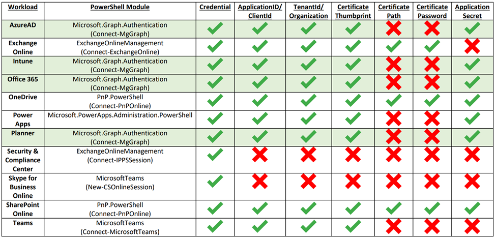
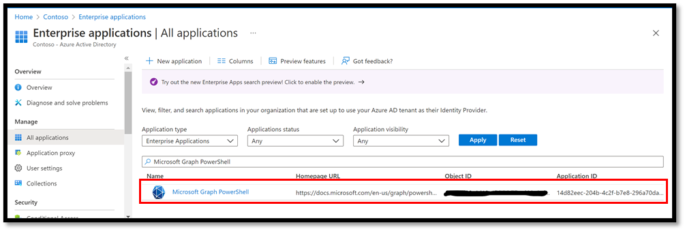

## Authentication Options

Each of the required modules used by Microsoft365DSC has its own authentication possibilities. So depending on the DSC resource you are using, there are several authentication options to choose from.

It is also very important to understand the authentication process of Microsoft365DSC. The solution supports connecting to the various workloads for either applying the configuration, monitoring it for configuration drifts or taking a snapshot of an existing configuration. It supports authenticating using either a set of credentials for a user or to use a Service Principal by specifying parameters such as an Azure Active Directory (AD) Application ID, Tenant ID and a Secret or Certificate.

**Important**: The recommendation is to use Service Principal whenever possible because:

- Service principals offers the most granular levels of security and do not introduce the risk of having to send high privileged credentials across the wire to authenticate.
- Since Desired State Configuration is an unattended process, the use of Multi Factor Authentication for user credentials  is not supported by Microsoft365DSC.
    - ***Note:*** The only exception here is creating an Export of an existing tenant. Most often this is an interactive process where the ask for a second factor is possible.

## Authentication Methods

Unfortunately, not all workloads supported by Microsoft365DSC are currently able to handle authentication using a Service Principal. For example: The Security and Compliance and Microsoft Teams modules do not support authenticating using a Service Principal. The following table provides an overview of what authentication methods are supported by which workload and what underlying module is being used to authenticate:

<figure markdown>
   
  <figcaption>Supported Authentication Methods for Microsoft365DSC</figcaption>
</figure>

As you can see: While using Credentials is the least preferred option for security reasons, it is the only option that works across all supported workloads.

We are having discussions with the various product groups that are responsible for these PowerShell modules inside of Microsoft, to have better consistency across all workloads on how to authenticate. Items highlighted in green in the table above, are workloads for which the <a href="https://github.com/microsoftgraph/msgraph-sdk-powershell" target="_blank">Microsoft Graph PowerShell SDK</a> is used to authenticate against. The plan is to update the underlying logic of every component inside of Microsoft365DSC to leverage that SDK as new APIs become available on Microsoft Graph.

It is possible for a configuration to use a mix of Credentials and Service Principals to authenticate against the various workloads. For example, if you decide to keep a master configuration for all the configuration of your tenant, you could have Azure AD components use the Service Principal of an app you have created to authenticate, and further down in the configuration have your Security and Compliance components use credentials. That approach is perfectly fine, but we would recommend to try and split different workloads across different configuration files. That way the configuration becomes less complex and easier to manage.

It is also important to note that we have added logic inside of the commands that allows you to take a snapshot of your current tenant configuration to warn you when the components you are trying to capture can’t be accessed based on the authentication model you have selected.

> *For example:* If you are trying to take a snapshot of both Azure AD and Security and Compliance components, but are authenticating using a Service Principal, the tool will warn you that the Security and Compliance components can’t be captured and that they will be ignored. In this case, the resulting capture would only contain the Azure AD components because those are the only ones the tool can get access to using Service Principal.

<figure markdown>
   
  <figcaption>Export only exports resources that support the used authentication method</figcaption>
</figure>

## Microsoft Graph Permissions
Most components of the Microsoft365DSC solution are using the Microsoft Graph PowerShell SDK under the cover to authenticate and interact with Microsoft 365. By default, if you are using Microsoft365DSC without using your own <a href="https://docs.microsoft.com/en-us/azure/active-directory/develop/quickstart-register-app" target="_blank">Azure Active Directory application instance</a>, the tool will automatically use the Microsoft Graph PowerShell application instance to authenticate.

<figure markdown>
  
  <figcaption>View of the default Graph PowerShell Enterprise Application</figcaption>
</figure>

### Determine Required Permissions
In order to be able to interact with these components, you need to grant your application or the Microsoft Graph PowerShell one the proper permissions against the Microsoft Graph scope. To determine what permission what permissions are required by a given component that uses Microsoft Graph, you can use the <a href="../../cmdlets/Get-M365DSCCompiledPermissionList/">Get-M365DSCCompiledPermissionList</a> cmdlet and pass in the list of parameters for which you wish to grant permissions for.

<figure markdown>
  
  <figcaption>Example of how to check for the required permissions</figcaption>
</figure>

Doing so will return an object with two properties. The ReadPermissions property contains a list of the minimal permissions that need to be granted for the app to be able to read information about the selected components. These are the permissions you want to grant if you are taking a snapshot of the configuration of an existing tenant. The second property, UpdatePermissions, contains the minimal permissions required to interact with and configure the selected components. You will need to grant your application these permissions if you are trying to apply a configuration onto a tenant.

If you are trying to interact with all available components in Microsoft365DSC, you can get a complete picture of all permissions required across all resources by running the following line of PowerShell.

```PowerShell
Get-M365DSCCompiledPermissionList -ResourceNameList (Get-M365DSCAllResources)
```

<figure markdown>
  
  <figcaption>How to retrieve the permissions for all resources</figcaption>
</figure>

The **Get-M365DSCAllResources** cmdlet will return a list of all components available inside of the Microsoft365DSC solution which will then by passed in the Get-M365DSCCompiledPermissionList cmdlet which will compile the resulting permissions needed for the list of components it receives, in occurrence all of them. These permissions need to be granted to your application instance, either using the Azure portal or automating the process via PowerShell.

### Providing Consent For Graph Permissions
We provide an easy way of consenting permissions to the Microsoft Graph PowerShell application in your tenant with the <a href="../../cmdlets/Update-M365DSCAllowedGraphScopes/">Update-M365DSCAllowedGraphScopes</a> cmdlet. This cmdlet accepts either a list of components to grant the permissions for or can grant it for all resources if the **-All** switch is used. You also need to specify what type of permissions, Read or Update, you wish to grant it using the **-Type** parameter.

<figure markdown>
  
  <figcaption>Consenting to requested Graph permissions</figcaption>
</figure>

Executing the cmdlet will prompt you to authenticate using an administrator account that has access to consent permissions to Azure AD applications in your environment.

## SharePoint PnP PowerShell Permissions
All SharePoint Online resources are using the <a href="https://github.com/pnp/powershell" target="_blank">SharePoint PnP PowerShell</a> module. Just like the Graph module, you can use the default PnP PowerShell app registration or create your own app registration.

> **Note**: For more information about authentication in PnP PowerShell, check out <a href="https://pnp.github.io/powershell/articles/authentication.html" target="_blank">this</a> article.

### Default PnP PowerShell app registration
Use the "<a href="https://pnp.github.io/powershell/cmdlets/Register-PnPManagementShellAccess.html" target="_blank">Register-PnPManagementShellAccess</a>" cmdlet to register this application in Azure Active Directory and grant the correct permissions.

### Using your own Azure AD app
<a href="https://docs.microsoft.com/en-us/azure/active-directory/develop/quickstart-register-app" target="_blank">Create a new app registration</a> in Azure AD yourself and grant the correct permissions to this app. The documentation on this website for each of the SharePoint Online resources list the permissions needed for the resource.

As an alternative, you can use the "<a href="https://pnp.github.io/powershell/cmdlets/Register-PnPAzureADApp.html" target="_blank">Register-PnPAzureADApp</a>" cmdlet to have PnP PowerShell create the app registration for you and grant the correct permissions.
