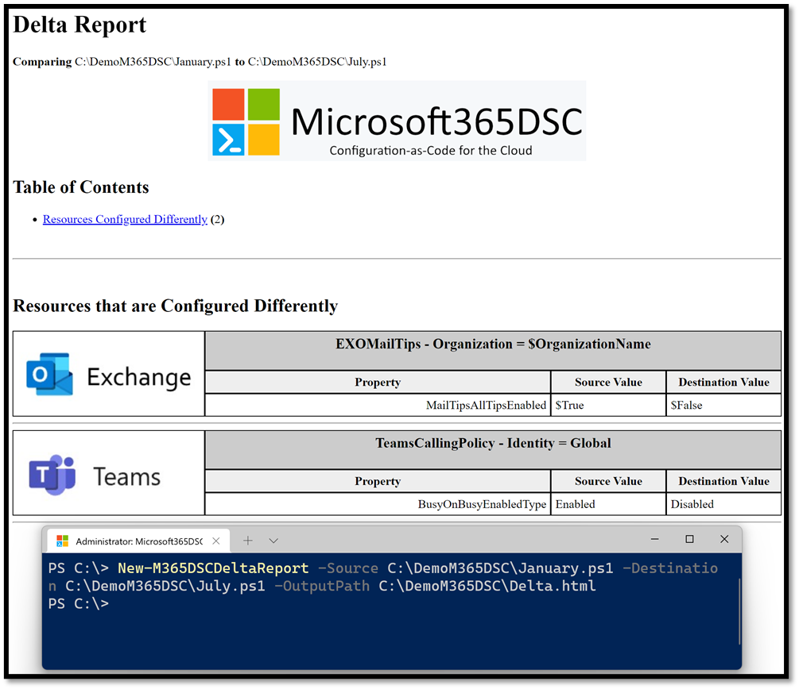
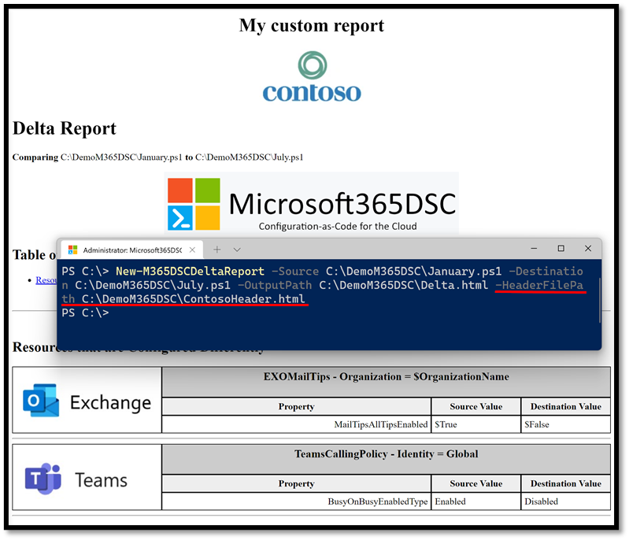

The Microsoft365DSC solution includes a built-in engine to compare two configurations and generate a delta report in HTML that reveals any discrepancies between them. You can either compare two configuration files exported from the same tenant at different points in time, or to compare one tenant's configuration against another's and inspect how their configurations differ.

## Comparing 2 Configuration Files

Using the <a href="../../cmdlets/New-M365DSCDeltaReport/">New-M365DSCDeltaReport</a> cmdlet, you can specify the two configuration files you wish to compare using the **-Source** and **-Destination** parameters. Then you just need to specify where you wish to store the resulting HTML report using the **-OutputPath** parameter.

Consider the following example where we have taken two configuration snapshots of a tenant, 6 months apart. The goal is to determine what configuration settings have changed over that period of time. Using the **New-M365DSCDeltaReport** cmdlet, we can easily compare the two and generate a delta report as shown in the image below.

<figure markdown>
  
  <figcaption>Generating a Delta Report of two configurations</figcaption>
</figure>

We can also customize the generated report by injecting custom HTML into its header. To do so, simply provide the location of the HTML file to inject in the header of the report using the **-HeaderFilePath** parameter. The example shown in the following picture shows how to add your customer header to a delta report.

<figure markdown>
  
  <figcaption>Generating a Delta Report of two configurations with a custom header</figcaption>
</figure>

## Comparing a Tenant's Configuration Against Another's

Using Microsoft365DSC, you can compare any configuration file against the current configuration of another Microsoft 365 tenant. This can be very useful in comparing the state and settings between tenants in scenarios like mergers and acquisitions, or managing Dev and Production tenants. For example, let’s assume you are trying to compare the configuration of Tenant A with that of Tenant B. You would start by taking a snapshot of both tenants (using <a href="../../cmdlets/Export-M365DSCConfiguration/" target="_blank">Export-M365DSCConfiguration</a>), then compare Tenant A's snapshot against the configuration of Tenant B using the **New-M365DSCDeltaReport** cmdlet.
