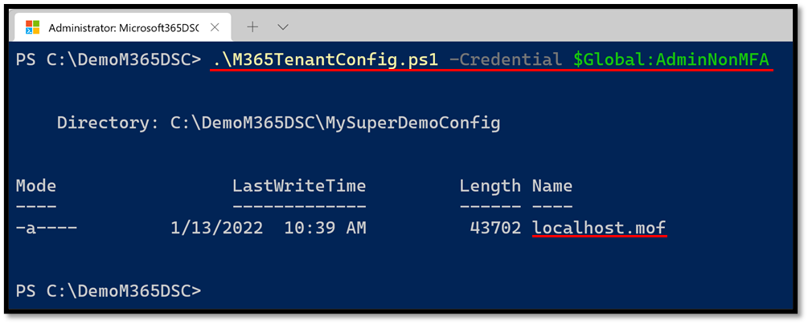
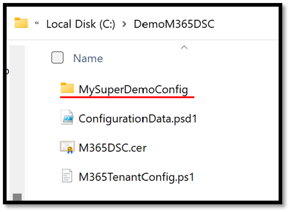
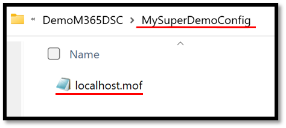
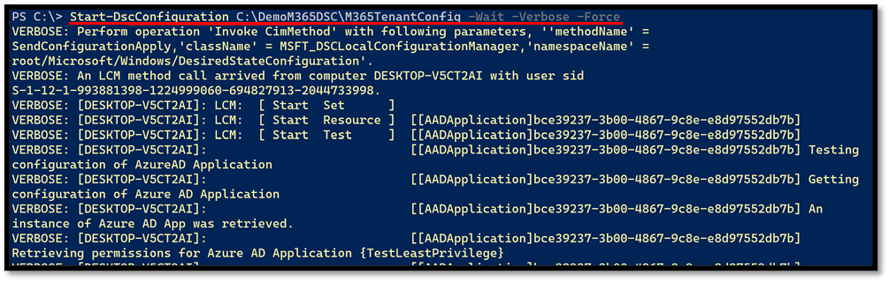
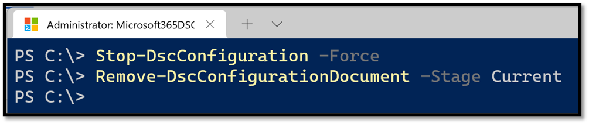

This section explains how you can take a Microsoft365DSC configuration file you have written (or captured using the snapshot feature) and apply the settings it defines onto a Microsoft 365 tenant. It is very important to understand that at this stage, we are using PowerShell Desired State (DSC) out-of-the-box and that the process of applying a DSC configuration is not something specific to Microsoft365DSC.

## Creating your own DSC Configuration

Microsoft365DSC is built on top of the PowerShell Desired State Configuration framework. Therefore, before you get started with Microsoft365DSC, it is important to know the basics and best practices of <a href="https://docs.microsoft.com/en-us/powershell/dsc/overview/dscforengineers?view=dsc-1.1" target="_blank">PowerShell Desired State Configuration</a> (DSC). Here is a small introduction to PowerShell DSC:

PowerShell DSC is a declarative approach for configuring servers and environments. It is based on the <a href="https://en.wikipedia.org/wiki/Open_Management_Infrastructure" target="_blank">Open Management Infrastructure</a> (implemented in Windows as WMI). PowerShell offers a way to declare a desired state in PowerShell syntax, compile this to what's known as a _MOF_ (Managed Object Framework) file, and publish that to a target machine.

On that target machine the <a href="https://docs.microsoft.com/en-us/powershell/dsc/managing-nodes/metaconfig?view=dsc-1.1" target="_blank"> LCM (Local Configuration Manager)</a> will do the heavy lifting and make sure your server __gets into the desired state__, detects when the server __deviates from the desired state__ or even automatically __corrects and brings the server back to its desired state__.

By default PowerShell offers several <a href="https://docs.microsoft.com/en-us/powershell/dsc/resources/resources?view=dsc-1.1#windows-built-in-resources" target="_blank">resources</a> out-of-the-box, but these can be extended by <a href="https://docs.microsoft.com/en-us/powershell/dsc/configurations/install-additional-dsc-resources?view=dsc-1.1" target="_blank">installing modules</a> like Microsoft365DSC.

To create and deploy your own Desired State:

1. You create a <a href="https://docs.microsoft.com/en-us/powershell/dsc/configurations/configurations?view=dsc-1.1" target="_blank">DSC Configuration</a>
2. You compile your PowerShell configuration <a href="https://docs.microsoft.com/en-us/powershell/dsc/configurations/write-compile-apply-configuration?view=dsc-1.1#compile-the-configuration" target="_blank">to a MOF file</a> (see <a href="#compiling-and-validating-the-configuration">paragraph below</a>)
3. Finally, you <a href="https://docs.microsoft.com/en-us/powershell/dsc/configurations/write-compile-apply-configuration?view=dsc-1.1#apply-the-configuration" target="_blank">apply the MOF file</a> to your target server (see <a href="#deploying-the-configuration">paragraph below</a>)

We highly recommend that you watch the <a href="https://docs.microsoft.com/en-us/shows/getting-started-with-powershell-dsc/" target="_blank">"Getting Started with PowerShell Desired State Configuration"</a> training on Microsoft Learn.

For more information and more advanced topics, please make sure you review the following articles:

- <a href="https://docs.microsoft.com/en-us/powershell/dsc/configurations/add-parameters-to-a-configuration?view=dsc-1.1" target="_blank">Add Parameters to a Configuration</a>
- <a href="https://docs.microsoft.com/en-us/powershell/dsc/configurations/separatingenvdata?view=dsc-1.1" target="_blank">Separating configuration and environment data</a>
- <a href="https://docs.microsoft.com/en-us/powershell/dsc/configurations/configdata?view=dsc-1.1" target="_blank">Using configuration data in DSC</a>
- <a href="https://devblogs.microsoft.com/powershell/want-to-secure-credentials-in-windows-powershell-desired-state-configuration" target="_blank">Want to secure credentials in Windows PowerShell Desired State Configuration?</a>
- <a href="https://docs.microsoft.com/en-us/powershell/dsc/pull-server/securemof?view=dsc-1.1" target="_blank">Securing the MOF File</a>
- [Securing your Compiled Configuration](../securing-configurations) (Next chapter in this guide)

## Compiling and Validating the Configuration

The first step in trying to deploy a DSC configuration is to compile the configuration file into a MOF file. Doing so simply involves executing the .ps1 file that contains your configuration. The process of compiling your configuration will also perform some level of validation on the configuration, such as ensuring that every component defined in the file has all of their mandatory parameters defined, and that there are no typos in components or property names. If the compilation process is successful, you should see a message indicating that the MOF file was created. By default, this file is created in the same path your configuration file is located, and will create a new subfolder based on the name of the configuration object defined within your file.

<figure markdown>
  
  <figcaption>Running a configuration compilation</figcaption>
</figure>

<figure markdown>
  
  <figcaption>Created configuration folder</figcaption>
</figure>

<figure markdown>
  
  <figcaption>Created MOF file</figcaption>
</figure>

## Deploying the Configuration
To initiate the deployment of a MOF file onto a Microsoft 365 tenant, you need to use the out-of-the-box cmdlet provided by PowerShell DSC called <a href="https://docs.microsoft.com/en-us/powershell/module/psdesiredstateconfiguration/start-dscconfiguration?view=dsc-1.1" target="_blank">Start-DSCConfiguration</a>. By default, this cmdlet will execute as an asynchronous background job. If you wish to monitor the execution of the process, you need to use the **-Wait** switch, which will make the execution synchronous. We also recommend using the **-Verbose** switch with the command to get additional details on the operation of the deployment process. The cmdlet takes as input the path to the folder containing the compiled MOF file. For example:

```PowerShell
Start-DSCConfiguration -Path C:\DemoM365DSC\M365TenantConfig -Wait -Verbose -Force
```

Executing the cmdlet will automatically authenticate against the affected workload using the authentication parameters provided at compilation time and will apply the configuration settings defined in the file.

<figure markdown>
  
  <figcaption>Initiating a MOF deployment</figcaption>
</figure>

It is normal for this process to take several minutes (if not hours) to complete, based on how many components are defined in your configuration. It is important to understand that once the configuration completes its deployment, this will configure the PowerShell DSC engine (LCM) on the current system to perform frequent repeated  checks against your Microsoft 365 tenant to test for configuration drifts. By default, the engine will wake up every 15 minutes (the minimum value possible). For more details on how to configure this, please refer to <a href="https://docs.microsoft.com/en-us/powershell/dsc/managing-nodes/metaconfig?view=dsc-1.1" target="_blank">Configuring the Local Configuration Manager</a>.

If you simply want to apply the configuration on the tenant as a one-off and prevent the system from running subsequent checks for configuration drifts, you can  remove the configuration you have applied by afterwards running the following PowerShell commands:

```PowerShell
Stop-DSCConfiguration -Force
Remove-DSCConfigurationDocument -Stage Current
```

<figure markdown>
  )
  <figcaption>Stopping a DSC configuration deployment</figcaption>
</figure>
