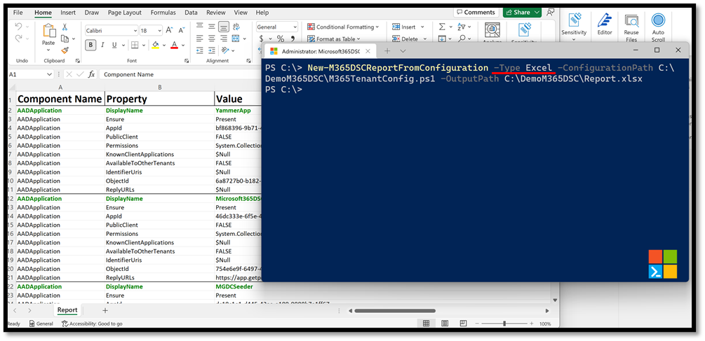
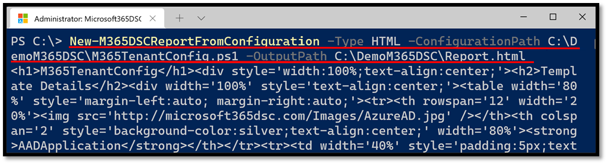
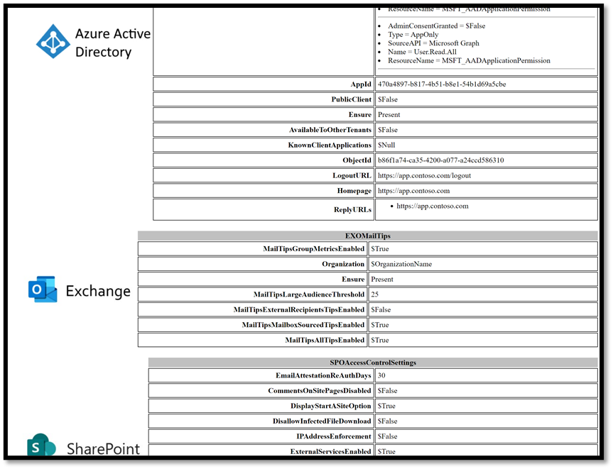

Microsoft365DSC makes it very easy to generate user-friendly reports from any configuration, whether you wrote it yourself or generated it using the configuration snapshot feature. The solution allows you to generate HTML, Excel and JSON reports from existing files.

> **NOTE:** To generate Excel reports, you need to have Office installed on the machine on which you are trying to generate the report.

## Generate Report

To generate reports, simply use the <a href="../../cmdlets/New-M365DSCReportFromConfiguration/">New-M365DSCReportFromConfiguration</a> cmdlet and specify what type of report you want using the **Type** parameter (HTML, Excel or JSON). The cmdlet also requires you to specify the full path to the .ps1 configuration file you want to generate the report from using the **-ConfigurationPath** parameter, and specify where you wish to store the generated report using the **-OutputPath** parameter.

## Excel Report

Generating an Excel report from a configuration will automatically launch the Excel client as part of the process. Users will see data being loaded progressively into the workbook, and once the generation process has finished, the columns will automatically be resized to fit the content. The report will also automatically format the key mandatory parameter (e.g. primary key) of each resource in **bold** and apply some styling on the output.

<figure markdown>
  
  <figcaption>Generating an Excel report</figcaption>
</figure>

## HTML Report

Generating an HTML report works slightly differently. The **New-M365DSCReportFromConfiguration** cmdlet will create the report file at the location specified by the **OutputPath** parameter, but it won’t actually launch the report for display in a browser. The cmdlet, when used for HTML reports, will also return the raw HTML content of the report as shown in the image below.

<figure markdown>
  
  <figcaption>Generating an HTML report</figcaption>
</figure>

<figure markdown>
  
  <figcaption>Example of HTML report</figcaption>
</figure>
