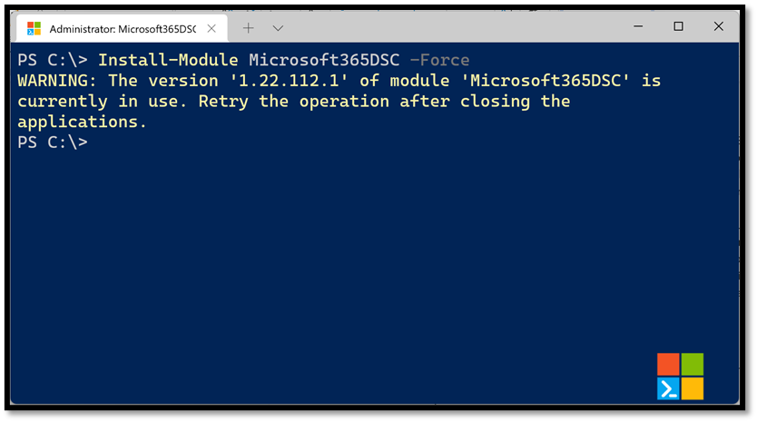
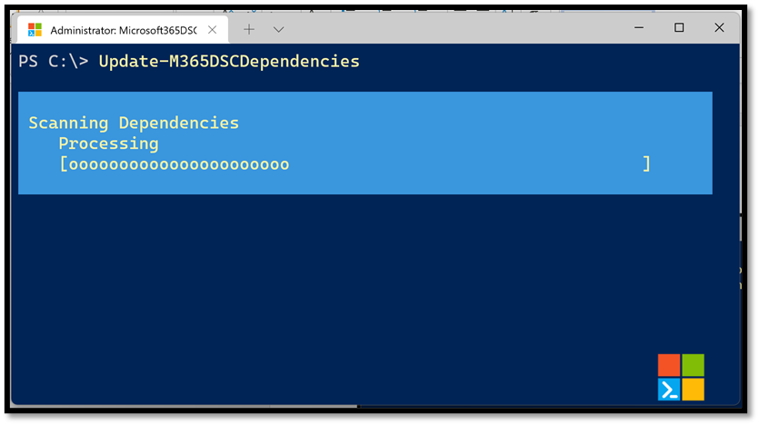
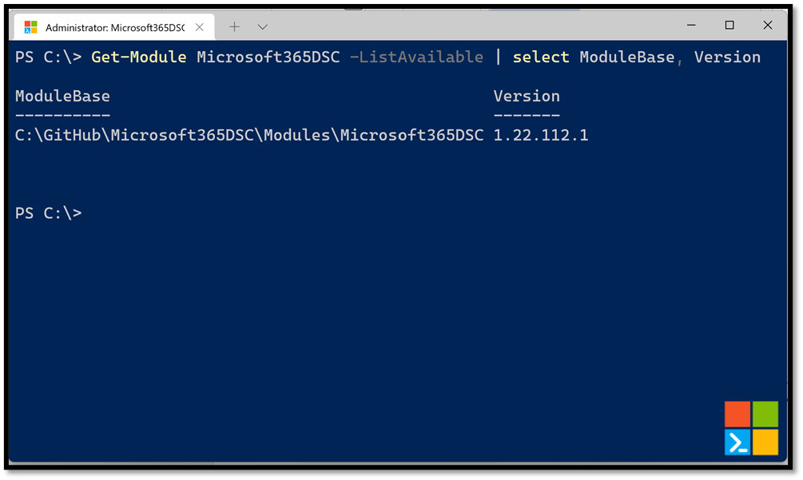

While the source code of the solution is open-sourced on <a href="https://GitHub.com/Microsoft/Microsoft365DSC" target="_blank">GitHub</a>, the releases of the solutions are being published to the <a href="https://www.powershellgallery.com/packages/Microsoft365DSC/" target="_blank">PowerShell Gallery</a>. This means that the tool can be installed onto any machine by running the following PowerShell command:
```PowerShell
Install-Module Microsoft365DSC -Force
```
 

Executing this command can take a minute or two to complete, after which the base Microsoft365DSC module has been installed.

## Dependencies

However, Microsoft365DSC depends on several other modules to function properly. For example, it uses the <a href="https://www.powershellgallery.com/packages/MSCloudLoginAssistant/">MSCloudLoginAssistant</a> module to delegate all authentication logic to the various workloads, it leverages a dozen <a href="https://www.powershellgallery.com/packages?q=Microsoft.Graph">Microsoft Graph PowerShell modules</a> to interact with various configuration settings, etc. Current versions of Microsoft365DSC no longer download all the required prerequisites by default. When you install the Microsoft365DSC, you only get the core component after which you have to download all prerequisite modules as well. It is our recommendation that you run the following command to update all dependencies on the system after installing the module:

```PowerShell
Update-M365DSCDependencies
```
 

Running the above command will automatically read the list of dependencies from the [Module Root]/Dependencies/Manifest.psd1 file, check to see if the proper version of these modules are installed on the machine, and (if not) automatically download them from the PowerShell Gallery and install on the local computer.

Depending on your configuration and the version of PowerShell you are using, the installed modules may be put in different locations. The process of installing a PowerShell module from the PowerShell Gallery really just comes down to downloading the files from the gallery as a zip, extracting them and copying to a location on the system that is associated with PowerShell via environment variables. The following command will allow you to view the version of any given PowerShell module on a system along with its associated version:
```PowerShell
Get-Module Microsoft365DSC -ListAvailable | select ModuleBase, Version
```
 

## More information

More information about installing modules:

- <a href="https://docs.microsoft.com/en-us/powershell/scripting/developer/module/installing-a-powershell-module?view=powershell-7.2" target="_blank">Installing a PowerShell module</a>
- <a href="https://docs.microsoft.com/en-us/powershell/module/powershellget/find-module?view=powershell-7.2" target="_blank">Find-Module cmdlet</a>
- <a href="https://docs.microsoft.com/en-us/powershell/module/powershellget/install-module?view=powershell-7.2" target="_blank">Install-Module cmdlet</a>
- <a href="https://docs.microsoft.com/en-us/powershell/module/powershellget/save-module?view=powershell-7.2" target="_blank">Save-Module cmdlet</a>
- <a href="https://docs.microsoft.com/en-us/powershell/module/microsoft.powershell.core/about/about_psmodulepath?view=powershell-7.2" target="_blank">About PSModulePath</a>

