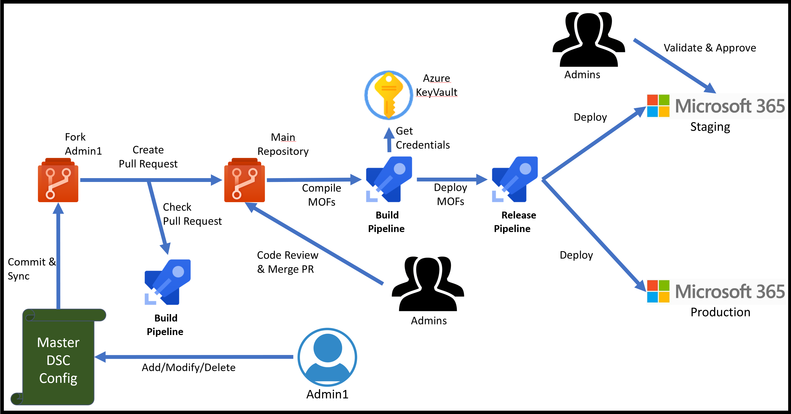

Microsoft365DSC takes all its sense when used as part of DevOps processes within the enterprise. You can use it to automate your Microsoft 365 Change Management process so that any requested configuration changes to tenants get tracked via systems like <a href="https://azure.microsoft.com/en-us/services/devops" target="_blank">Azure DevOps</a> or <a href="https://github.com/" target="_blank">GitHub</a> and use them to automate the deployment of your changes across your various tenants when a change is approved.

<figure markdown>
  
  <figcaption>Flow of managing Microsoft 365 using Microsoft365DSC and Azure DevOps</figcaption>
</figure>

While this article doesn’t cover the process of integrating Microsoft365DSC with these systems, our team has written a great <a href="https://office365dsc.azurewebsites.net/Pages/Resources/Whitepapers/Managing Microsoft 365 with Microsoft365Dsc and Azure DevOps.pdf">whitepaper</a> to help you get started with integrating Microsoft365DSC with Azure DevOps.
