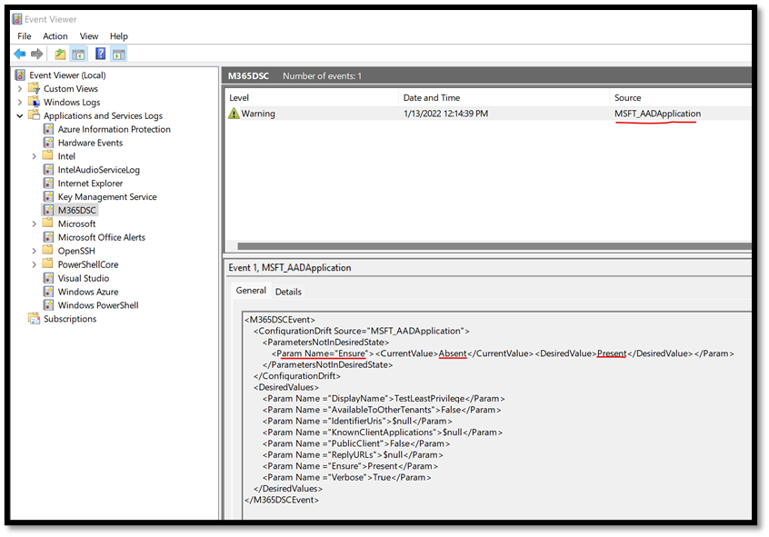
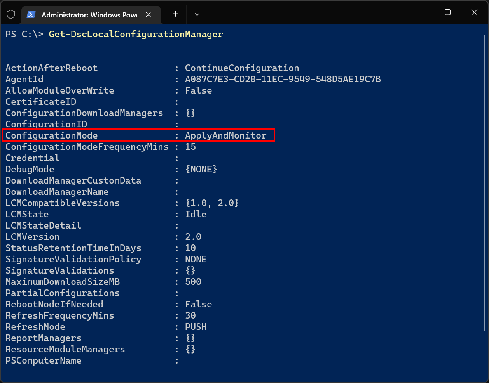

Once a configuration has been applied to a Microsoft 365 tenant using Microsoft365DSC, the local system will perform regular checks to analyze the configuration of the remote tenant against what its desired state should be and detect any configuration drifts. This feature comes from PowerShell DSC out-of-the-box and is not something specific to Microsoft365DSC. By default the DSC engine on the system where the configuration was applied from will check for configuration drifts every 15 minutes.

## Microsoft365DSC Event log

If a drift in configuration is detected, Microsoft365DSC will log it in Event Viewer on the machine. Detected drifts will get logged under the **M365DSC** log journal in Event Viewer. Microsoft365DSC provide very detailed entries in event viewer that help you identify exactly in what component a drift was detected as well as what property was detected to have drifted.

<figure markdown>
  
  <figcaption>Example of event in the M365DSC event log</figcaption>
</figure>

## Configuration Mode

Just like for any DSC module, you can also configure the DSC engine to automatically attempt to automatically fix detected drift and bring the tenant back into its desired state (**ApplyAndAutocorrect**). This is referred to as the DSC Configuration Mode.

To learn more about how you can configure the DSC engine to automatically fix detected drift, please refer to <a href="https://docs.microsoft.com/en-us/powershell/dsc/managing-nodes/metaconfig?view=dsc-1.1">Configuring the Local Configuration Manager</a>.

<figure markdown>
  
  <figcaption>Local Configuration Manager Configuration Mode</figcaption>
</figure>
