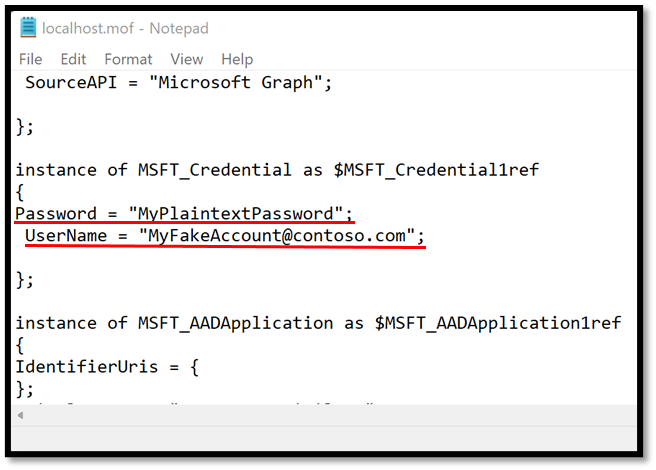
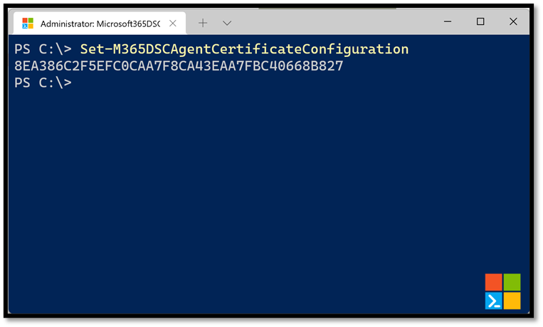
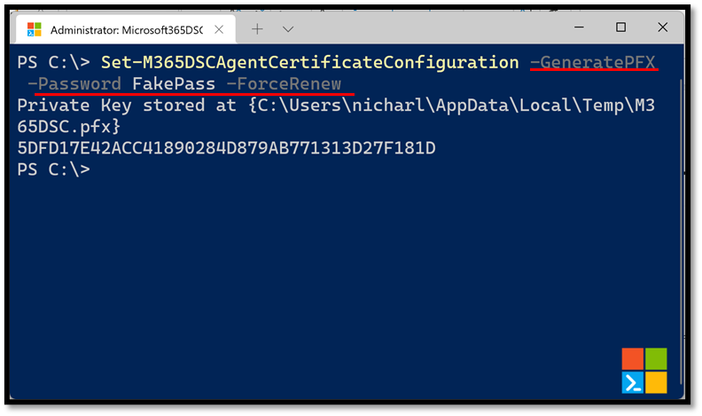
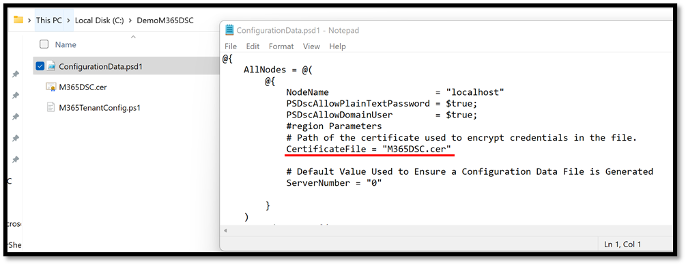
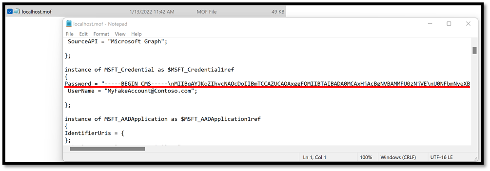

In the case where you are using credentials to authenticate to your tenant, you will be prompted to provide credentials at compilation time for your configuration. By default, these credentials will be stored as plain text in the resulting MOF file, which is a big security concern.

<figure markdown>
  
  <figcaption>Example of a MOF file with password in plain text</figcaption>
</figure>

## Creating an encryption certificate

To remediate to this, PowerShell DSC lets us <a href="https://docs.microsoft.com/en-us/powershell/dsc/pull-server/securemof?view=dsc-1.1" target="_blank">use an encryption certificate to encrypt information about credentials in the MOF files</a>. To make this process easier for users, Microsoft365DSC defines a function named <a href="../../cmdlets/Set-M365DSCAgentCertificateConfiguration/">Set-M365DSCAgentCertificateConfiguration</a> which will automatically generate an encryption certificate and configure the PowerShell DSC engine on the system to use it for encrypting the MOF files. The cmdlet will return the Thumbprint for the newly generated certificate.

<figure markdown>
  
  <figcaption>Example of cmdlet to generate LCM certificate</figcaption>
</figure>

You can also have the cmdlet generate the private key for the certificate by using the **-GeneratePFX** switch and specifying a password with the **-Password** parameter. This will require you to also specify the **-ForceRenew** parameter so that a brand new certificate gets emitted.

<figure markdown>
  
  <figcaption>Export LCM certificate to a PFX file</figcaption>
</figure>

## Using certificates in the configuration

Once the certificate has been configured every time you do a snapshot of an existing tenant’s configuration, a new M365DSC.cer certificate file will be stored in the same repository as the configuration files. The ConfigurationData.psd1 will also contain a new entry under the localhost node that will point to this certificate, effectively telling DSC to use this file to encrypt credentials when compiling.

<figure markdown>
  
  <figcaption>Example of Configuration Data with encryption certificate specified</figcaption>
</figure>

If you compile your configuration using the new certificate and take a look at your MOF file, you should see that the password for the credential object was successfully encrypted and is no longer stored in plaintext.

<figure markdown>
  
  <figcaption>Example of MOF file with encrypted password</figcaption>
</figure>
