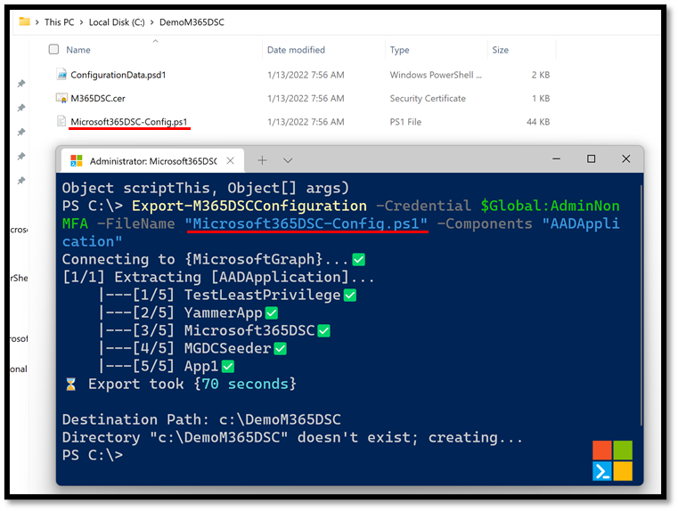

The first thing that most folks using Microsoft365DSC will want to do, is take a snapshot of an existing tenant they have access to and that they are familiar with.
As soon as you install the Microsoft365DSC module on a system, it will automatically get access to run the <a href="../../cmdlets/Export-M365DSCConfiguration/" target="_blank">Export-M365DSCConfiguration</a> PowerShell cmdlet, which is the main command for initiating a snapshot of an existing configuration.

In previous versions of the module, simply running the above cmdlet would automatically launch a Graphical User Interface that would allow you to pick and choose the components you wanted to capture the configuration for as part of your snapshot and initiate the capture process. Current versions of the module have moved to an unattended process by default, meaning that running the cmdlet will expect additional parameters by default and will then attempt to initiate the snapshot process automatically without further human interaction.

Initiating the snapshot process via the **Export-M365DSCConfiguration** cmdlet will begin by authenticating against all required workloads. The first thing it will do is compile a list of all components it is about to capture and figure out what workload they are part of. Then it will automatically authenticated against each one using the authentication parameters provided.

## Web Based User Interface

While the default process has changed with recent versions of the module, you can still use a newly revamped, web-based User Interface to help you build the PowerShell command to execute based on the components you wish to capture. To launch this new web interface, simply use the **-LaunchWebUI** switch when calling the Export-M365DSCConfiguration cmdlet. This will automatically launch a new web browser interface and navigate you to <a href="https://export.microsoft365dsc.com" target="_blank">https://export.microsoft365dsc.com</a>
<figure markdown>
  
  <figcaption>The Microsoft365DSC Export generator</figcaption>
</figure>

On the web page, simply select the components you want to export and click on the **Generate** button at the top right. This will open a new prompt that will allow you to copy the PowerShell command you need to run to capture a snapshot of the selected components via Microsoft365DSC. Simply copy this command and paste it in your PowerShell console to initiate the capture process.

<figure markdown>
  
  <figcaption>Example of a generated Export command</figcaption>
</figure>

## Unattended Capture

As mentioned above, Microsoft365DSC now defaults to an unattended capture process when running the **Export-M365DSCConfiguration** cmdlet. To quickly get started, simply open a new PowerShell console and run the cmdlet. By default, if you don’t provide any additional parameters to the cmdlet, it will try to use credentials to authenticate against the various workloads. In the case where no additional authentication parameters are provided, Microsoft365DSC will prompt you for credentials and will use those credentials to authenticate throughout the capture process.

<figure markdown>
  
  <figcaption>Ask for credentials</figcaption>
</figure>

<figure markdown>
  
  <figcaption>Authenticate against the Microsoft 365 workloads</figcaption>
</figure>

You can always pass in the credentials as a variable, which will bypass the credential prompt and automatically initiate the export process when calling the cmdlet. E.g.

```PowerShell
$creds = Get-Credential
Export-M365DSCConfiguration -Credential $creds
```

<figure markdown>
  
  <figcaption>Exporting using a Credential variable</figcaption>
</figure>

### Running An Export Using Service Principal

The same process applies if you are trying to authenticate using a Service Principal. In this case you would need to pass in the ApplicationID and TenantID parameter and decide whether to use an Application Secret or a Certificate Thumbprint.

<figure markdown>
  
  <figcaption>Using a service principal with an application secret</figcaption>
</figure>

<figure markdown>
  
  <figcaption>Using a service principal with a certificate thumbprint</figcaption>
</figure>

It is important to understand that the resulting file that contains the captured configuration will also implement the same authentication mechanism used by the capture process. For example, if you used credentials to capture the configuration, the resulting file will contain logic to capture credentials when it gets executed and every component it generates will also implement the **Credential** parameter.

<figure markdown>
  
  <figcaption>Example of an Exported configuration with credential</figcaption>
</figure>

In comparison, if you used a Service Principal to do the export, the resulting file will implement logic to receive information about the Azure AD application instance to use and every component defined within the file will as well.

<figure markdown>
  
  <figcaption>Example of an Exported configuration with service principal</figcaption>
</figure>

As shown in the image above, the Service Principal field values are coming from the Configuration Data file that also get stored along the configuration file during the snapshot process. If you take a look at the folder where the resulting files were stored, you should see a file named ConfigurationData.psd1. This is where the value for the parameters above are defined.

<figure markdown>
  
  <figcaption>Example of the generated Configuration Data file</figcaption>
</figure>

It is also important to note, the resulting file will always contain random GUID for the name of the resources in the DSC configuration. These are random and are only used to ensure we don’t have resource naming conflicts inside the configuration. They can be replaced by anything meaningful, as long as you don’t have two components of the same resource type named the same across your configuration. Names are meaningless in the world of DSC and are only used as a primary key when compiling your configuration.

<figure markdown>
  
  <figcaption>Example of the generated names for the resources</figcaption>
</figure>

## Available Parameters

The Microsoft365DSC tenant configuration snapshot feature offers several options you can use to better control the output capture. This section provides an overview of each additional parameter that is available for the **Export-M365DSCConfiguration** cmdlet and how they can be used during the capture process

### LaunchWebUI

As mentioned above, the moment this switch is present when calling the **Export-M365DSCConfiguration** cmdlet it will launch new browser window and navigate to the export user interface at https://export.microsoft365dsc.com.

```PowerShell
Export-M365DSCConfiguration -LaunchWebUI
```

### Components

This parameter accepts an array containing the names of the components you want to capture as part of your snapshot. Omitting this parameter will default the capture process to capture all components that are part of the default components list (see parameter **Mode**).

<figure markdown>
  
  <figcaption>Example of specifying resources to be exported</figcaption>
</figure>

### ConfigurationName

This parameter allows you to specify how the DSC configuration object, inside of the exported configuration file will be named.

<figure markdown>
  
  <figcaption>Example of specifying a custom configuration name</figcaption>
</figure>

Omitting to specify this parameter will result in the configuration object to be named as the file’s name (e.g. M365TenantConfig).

### FileName

This allows you to specify how you wish the resulting file to be named. Specify the name of the file, including the extension (e.g. .ps1).

<figure markdown>
  
  <figcaption>Example of specifying a custom file name</figcaption>
</figure>

Omitting to specify this parameter will name the resulting file as M365TenantConfig.ps1

### Filters

This allows you to specify a filter at the resource level to reduce the overall instances that are being extracted. As an example, if you are only interested in extracting Azure AD Groups that have their display name start with the word 'Microsoft', you could specify the following filters:

```
$Filters = @{
    AADGroup = "startsWith(displayName, 'Microsoft')"
}
```

<figure markdown>
  
  <figcaption>Example of using Filters to export resources</figcaption>
</figure>

### GenerateInfo

This parameter allows users to specify whether or not comments should be added as part of the exported file to provide additional information about the various types of components captured.
<figure markdown>
  
  <figcaption>Example of specifying whether to generate additional information</figcaption>
</figure>

### MaxProcesses

There are a few components inside of Microsoft365DSC for which parallelism has been implemented as part of their snapshot process to improve speed. This parameter allows user to specify how many parallel threads should be created during the capture process. Components leveraging parallelism are: SPOPropertyBag, SPOUserProfileProperty and TeamsUser. The specified value for this parameter has to be between **1** and **100**. Instances of the components will be equally divided amongst the various threads.

<figure markdown>
  
  <figcaption>Example of specifying a maximum number of 17 processes</figcaption>
</figure>

<figure markdown>
  
  <figcaption>Example of specifying a maximum number of 6 processes</figcaption>
</figure>

While there are advantages to implementing multithreading for the snapshot process, there are many disadvantages as well such as not being able to properly view ongoing progress inside threads and added complexity to the design of the resources. After weighting in the pros can cons of implementing this approach across all components to speed up the entire capture process, we’ve opted to keep the design of the resources simpler (no use parallelism) for maintenance purposes and to ensure users have a consistent way of view progress during the snapshot process.

### Mode

This parameter allows users to specify what set of components they wish to capture as part of their snapshot process. By default, Microsoft365DSC will exclude some components from the capture process either because these are likely to take a very long time to export (e.g. SPOPropertyBag) or that they are more related to data than actual configuration settings (e.g. Planner Tasks, SPOUserProfileProperty, etc.). Available modes are:

- Lite
- Default
- Full

Omitting this parameter will default to the **Default** mode.
To keep track of what resources are available in what mode, Microsoft365DSC defines two global variables which contain the list of resources unique to this extraction mode: **$Global:DefaultComponents** and **$Global:FullComponents**

<figure markdown>
  
  <figcaption>Example of the default Export modes</figcaption>
</figure>

This means that the **Lite** extraction mode will contain all resources with the exception of those listed in Default and Full. The **Default** mode will include all resources from the Lite mode, plus the SPOApp and SPOSiteDesign components, and **Full** will include every resource available in the project.

### Path

This parameter allows you to specify the location where the resulting file will be stored. Omitting to specify this parameter will prompt the user to provide the destination path at the end of the capture process.

<figure markdown>
  
  <figcaption>Example of specifying a custom export path</figcaption>
</figure>

### Workloads

This parameter accepts an array containing the names of various workloads you wish to capture the components for as part of your snapshot process.  Users need to specify the acronym of the workloads, which can be any of:

- **AAD** – Azure Active Directory
- **EXO** – Exchange Online
- **O365** – Office 365 administration
- **Intune** – Intune
- **OD** – OneDrive
- **Planner** – Planner
- **PP** – Power Platform
- **SC** – Security and Compliance
- **SPO** – SharePoint Online
- **Teams** – Microsoft Teams

<figure markdown>
  
  <figcaption>Example of specifying an export based on workload</figcaption>
</figure>

By default, specifying a workload will only export components that are part of the default component list (see **Mode**). If you want to capture every component available for a given workload, you will need to combine this parameter with **-Mode Full**.
